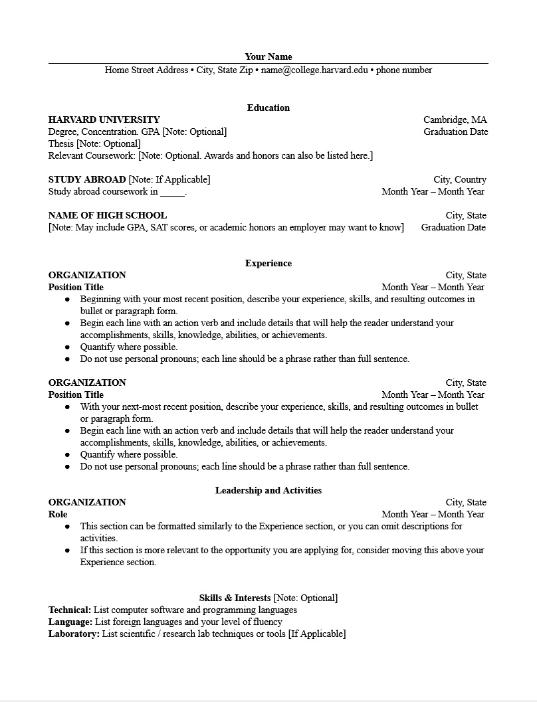
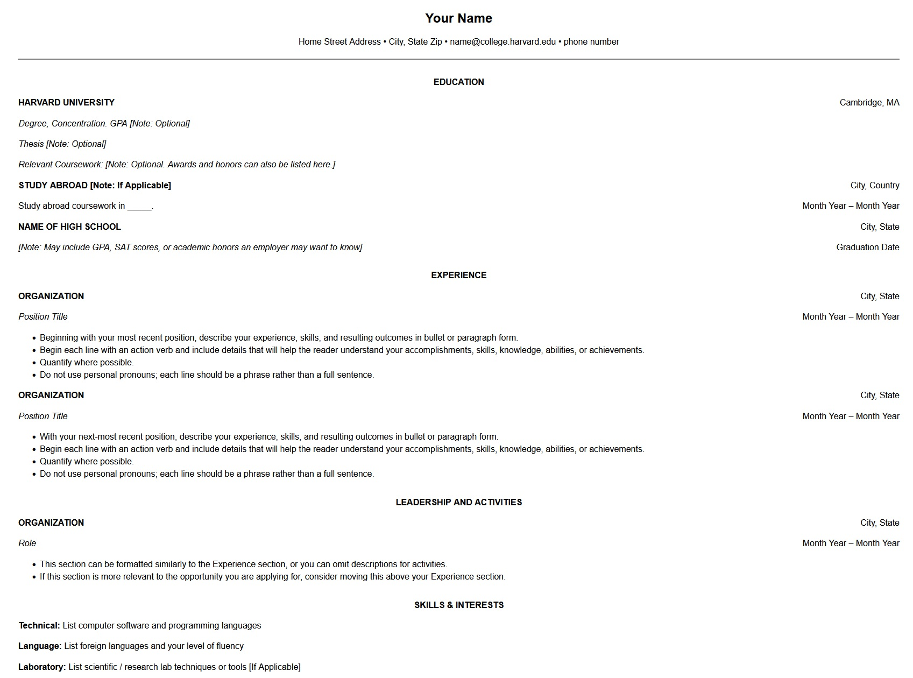

# Frontend Technical Specification

- Create a static website that serves an HTML resume

## Resume Format Considerations

USA resumes are usually accepted with word/pdf format and need to exclude personal info due to US laws. Ex. Age, Photo, Street, Race

Will be using the [Harvard Resume Template Format](https://docs.google.com/document/d/1rK2prBm6ga4EGdlbNZ66NS0_KBLrOCSf/edit) to format the html resume.

### Harvard Resume Format Generation

I will be using GenAI to generate the HTML format for the resume to look like the below and use CSS to assist with the design. 

Afterwards, will manually refactor to add finishing touches to the HTML resume.

Prompt to ChatGPT:

'''text
Convert this resume format into html.
Please don't use a CSS framework.
Please use least amount of css tags.
'''

Image provided to LLM:

Unaltered HTML resume provided by LLM:

The [generated output](./assets/resume-minimal.html) output which I will refactor.

## HTML Adjustments 

- UTF8 support for most languages, I am looking into learning Japanese. Maybe something to consider down the line.
- Will be applying mobile styling added viewport meta tag. For viewers to view on their phone as everyone has one by now.